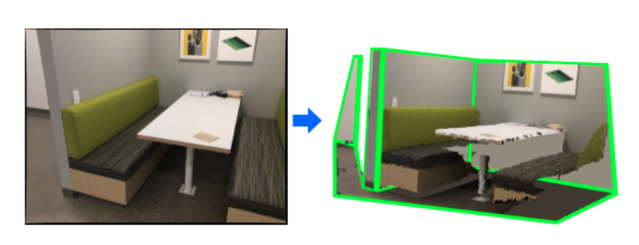

# General 3D Room Layout from a Single View by Render-and-Compare

By Sinisa Stekovic, Shreyas Hampali, Mahdi Rad, Sayan Deb Sarkar, Friedrich Fraundorfer, Vincent Lepetit
 
This repository contains a reimplementation of our work "General 3D Room Layout from a Single View by Render-and-Compare" that was presented at ECCV 2020. 

##### Note

The reimplementation of the method might perform slightly differently in comparison to the published results.

This implementation contains only the contributions from our original work. 
To run the method with custom images, depth, plane segmentation, and semantic segmentation are required.
Please see examples folder.

## Introduction

We present a novel method to reconstruct the 3D layout of a room—walls, floors, ceilings—from a single perspective view in challenging conditions, by contrast with previous single-view methods restricted to cuboid-shaped layouts.
Our approach is formalized as solving a constrained discrete optimization problem to find the set of 3D polygons that constitute the layout. In order to deal with occlusions between components of the layout, which is a problem ignored by previous works, we introduce an analysis-by-synthesis method to iteratively refine the 3D layout estimate. 

## Example Folder Structure

Current repository provides some of the inference examples from the ScanNet-Layout dataset. If you 
would like to test the method on your images, you first need to extract planes masks 
(e.g by [PlaneRCNN](https://github.com/NVlabs/planercnn)) and 
semantic segmentation (e.g. by [MSEG](https://github.com/mseg-dataset/mseg-semantic)).

Provided examples use the following structure:

* |--examples
    * |--------color - original color images from the ScanNet dataset (*.jpg)  
    * |--------depth - corresponding depth maps from the ScanNet dataset (*.png)  
    * |--------depth_filled - corresponding filled depth maps from the ScanNet dataset (*.png) (we used https://github.com/kujason/ip_basic) 
    * |--------mseg_labels - MSEG network semantic labels predictions (*.png) (Please see https://github.com/mseg-dataset/mseg-semantic)
    * |--------mseg_confidence - MSEG network confidence predictions for the predicted semantic labels (*.png)
    * |--------planercnn_seg - PlaneRCNN network planes instance masks predictions (*.npy) (Please see https://github.com/NVlabs/planercnn)

## Inference

First, setup the paths in `rl_config.py` file. Then, run the `infer_layout_from_image.py`. 
To visualize intermediate results, you can set `plot_intermediate_results = True` in `rl_config.py`.

## Dataset 

If you are interested into our ScanNet-Layout dataset, please visit https://github.com/vevenom/ScanNet-Layout .

## Citation
If you use this dataset, please cite:

@article{stekovic2020general,

  title={{General 3D Room Layout from a Single View by Render-and-Compare}},  
  
  author={Stekovic, Sinisa and Hampali, Shreyas and Rad, Mahdi and Deb Sarkar, Sayan and Fraundorfer, Friedrich and Lepetit, Vincent},  
  
  journal={{European Conference on Computer Vision (ECCV)}},  
  
  year={2020}  
}

## License
This work is distributed under BSD Clear license. See LICENSE file.

## Acknowledgment 

This work was supported by the Christian Doppler Laboratory for Semantic 3D Computer Vision, funded in part by Qualcomm Inc.